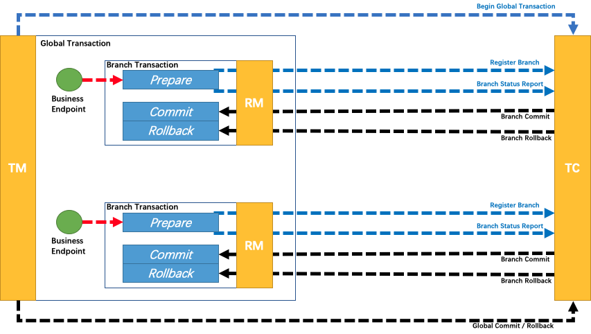

# Seata 分布式事务解决方案

Seata 是一款开源的分布式事务解决方案，致力于提供高性能和简单易用的分布式事务服务。Seata 将为用户提供了 AT、TCC、SAGA 和 XA 事务模式，为用户打造一站式的分布式解决方案。

### Seata 安装

官方 Github 仓库下载（v1.7.0）：https://github.com/apache/incubator-seata/releases/tag/v1.7.0

**配置 Seata**

解压缩后，在程序目录下找到 conf 文件夹

里面有一个配置文件 application.yaml 以及一份配置样例 application.example.yml

本次演示使用 Nacos 配置，将 application.yaml 下 seata.conf 和 seata.registry 的 type 修改为 nacos，并将配置样例中的 nacos 部分复制到配置文件内，修改对应的 server-addr 即可（如果有认证需放开 access-key 和 secret-key 配置并填入登录 nacos 的账号密码）。

```yaml
seata:
  config:
    # support: nacos, consul, apollo, zk, etcd3
    type: nacos
    nacos:
      server-addr: 127.0.0.1:8848
      namespace:
      group: SEATA_GROUP
      username:
      password:
      context-path:
      ##if use MSE Nacos with auth, mutex with username/password attribute
      #access-key:
      #secret-key:
      data-id: seataServer.properties
  registry:
    # support: nacos, eureka, redis, zk, consul, etcd3, sofa
    type: nacos
    nacos:
      application: seata-server
      server-addr: 127.0.0.1:8848
      group: SEATA_GROUP
      namespace:
      cluster: default
      username:
      password:
      context-path:
      ##if use MSE Nacos with auth, mutex with username/password attribute
      #access-key:
      #secret-key:
```

注意这里的 seata.conf 最后一行的 `data-id: seataServer.properties` 这里有一份 seata 在 nacos 的配置。此时我们需要在 nacos 创建一份同名文件（注意 Group 需要和 application.yaml 中的 seata.conf.group 一致）

seataServer.properties 同样有一份配置样例，在 seata 安装目录下的 script/config-center/config.txt 中，我们按需复制覆盖配置即可，例如：AT 模式需要的 db store 支持

**启动 seata**

window：双击 bin/seata-server.bat 文件

linux：sh seata-server.sh 


验证 seata 启动成功的方式：

1. nacos 注册是否成功
2. 访问 seata 控制台：http://localhost:7091


---

**Seata 的三大角色**

- TC (Transaction Coordinator) - 事务协调者
  维护全局和分支事务的状态，驱动全局事务提交或回滚
- TM (Transaction Manager) - 事务管理器
  定义全局事务的范围：开始全局事务、提交或回滚全局事务
- RM (Resource Manager) - 资源管理器
  管理分支事务处理的资源，与TC交谈以注册分支事务和报告分支事务的状态，并驱动分支事务提交或回滚

PS：TC 为单独部署的 Server 服务端，TM 和 RM 为嵌入到应用中的 Client 客户端

### Seata 项目集成

1）引入 spring cloud 和 spring cloud alibaba 集成

```xml
<!-- Spring Cloud 依赖 -->
<dependency>
    <groupId>org.springframework.cloud</groupId>
    <artifactId>spring-cloud-dependencies</artifactId>
    <version>${springcloud.version}</version>
    <type>pom</type>
    <scope>import</scope>
</dependency>
<!-- Spring Cloud Alibaba 依赖 -->
<dependency>
    <groupId>com.alibaba.cloud</groupId>
    <artifactId>spring-cloud-alibaba-dependencies</artifactId>
    <version>${springcloudalibaba.version}</version>
    <type>pom</type>
    <scope>import</scope>
</dependency>
```

2）添加 seata 依赖

```xml
<dependency>
    <groupId>com.alibaba.cloud</groupId>
    <artifactId>spring-cloud-starter-alibaba-nacos-discovery</artifactId>
</dependency>
<!-- 排除 spring cloud 版本内的 seata 版本 -->
<dependency>
    <groupId>com.alibaba.cloud</groupId>
    <artifactId>spring-cloud-starter-alibaba-seata</artifactId>
    <exclusions>
        <exclusion>
            <groupId>io.seata</groupId>
            <artifactId>seata-spring-boot-starter</artifactId>
        </exclusion>
        <exclusion>
            <groupId>io.seata</groupId>
            <artifactId>seata-all</artifactId>
        </exclusion>
    </exclusions>
</dependency>
<!-- 指定与安装 seata 相同版本的依赖 -->
<dependency>
    <groupId>io.seata</groupId>
    <artifactId>seata-spring-boot-starter</artifactId>
    <version>1.7.0</version>
</dependency>
```

3）配置 nacos 和 seata

```yaml
spring:
  application:
    name: order-server
  cloud:
    nacos:
      server-addr: localhost:8848
seata:
  enabled: true
  application-id: ${spring.application.name}
  tx-service-group: ${spring.application.name}-group
  service:
    vgroup-mapping:
      storage-server-group: default
  registry:
    type: nacos
    nacos:
      application: seata-server
      server-addr: 127.0.0.1:8848
      namespace:
      group: SEATA_GROUP
```

启动项目，TM 和 RM 注册成功

```
2024-11-05 15:09:54.506  INFO 20576 --- [           main] i.s.c.r.netty.NettyClientChannelManager  : will connect to 10.0.0.197:8091
2024-11-05 15:09:54.638  INFO 20576 --- [           main] i.s.core.rpc.netty.NettyPoolableFactory  : NettyPool create channel to transactionRole:TMROLE,address:10.0.0.197:8091,msg:< RegisterTMRequest{version='1.7.0', applicationId='order-server', transactionServiceGroup='order-server-group', extraData='ak=null
digest=order-server-group,10.0.0.197,1730790594637
timestamp=1730790594637
authVersion=V4
vgroup=order-server-group
ip=10.0.0.197
'} >
2024-11-05 15:09:54.975  INFO 20576 --- [           main] i.s.c.rpc.netty.TmNettyRemotingClient    : register TM success. client version:1.7.0, server version:1.7.0,channel:[id: 0x177129d6, L:/10.0.0.197:61152 - R:/10.0.0.197:8091]
2024-11-05 15:09:54.979  INFO 20576 --- [           main] i.s.core.rpc.netty.NettyPoolableFactory  : register success, cost 81 ms, version:1.7.0,role:TMROLE,channel:[id: 0x177129d6, L:/10.0.0.197:61152 - R:/10.0.0.197:8091]
2024-11-05 15:09:54.980  INFO 20576 --- [           main] i.s.s.a.GlobalTransactionScanner         : Transaction Manager Client is initialized. applicationId[order-server] txServiceGroup[order-server-group]
2024-11-05 15:09:55.686  INFO 20576 --- [           main] i.s.c.r.netty.NettyClientChannelManager  : will connect to 10.0.0.197:8091
2024-11-05 15:09:55.686  INFO 20576 --- [           main] i.s.c.rpc.netty.RmNettyRemotingClient    : RM will register :jdbc:mysql://localhost:3306/se_order
2024-11-05 15:09:55.687  INFO 20576 --- [           main] i.s.core.rpc.netty.NettyPoolableFactory  : NettyPool create channel to transactionRole:RMROLE,address:10.0.0.197:8091,msg:< RegisterRMRequest{resourceIds='jdbc:mysql://localhost:3306/se_order', version='1.7.0', applicationId='order-server', transactionServiceGroup='order-server-group', extraData='null'} >
2024-11-05 15:09:55.699  INFO 20576 --- [           main] i.s.c.rpc.netty.RmNettyRemotingClient    : register RM success. client version:1.7.0, server version:1.7.0,channel:[id: 0x3ae041ca, L:/10.0.0.197:61158 - R:/10.0.0.197:8091]
2024-11-05 15:09:55.699  INFO 20576 --- [           main] i.s.core.rpc.netty.NettyPoolableFactory  : register success, cost 10 ms, version:1.7.0,role:RMROLE,channel:[id: 0x3ae041ca, L:/10.0.0.197:61158 - R:/10.0.0.197:8091]
```

### 事务模式

#### XA 模式

XA 规范 是 X/Open 组织定义的分布式事务处理（DTP，Distributed Transaction Processing）标准。Seata XA 模式是利用事务资源（数据库、消息服务等）对 XA 协议的支持，以 XA 协议的机制来管理分支事务的一种事务模式。


优势

与 Seata 支持的其它事务模式不同，XA 协议要求事务资源本身提供对规范和协议的支持，所以事务资源（如数据库）可以保障从任意视角对数据的访问有效隔离，满足全局数据一致性。此外的一些优势还包括：

- 业务无侵入：和 AT 一样，XA 模式将是业务无侵入的，不给应用设计和开发带来额外负担。
- 数据库的支持广泛：XA 协议被主流关系型数据库广泛支持，不需要额外的适配即可使用。

缺点

XA prepare 后，分支事务进入阻塞阶段，收到 XA commit 或 XA rollback 前必须阻塞等待。事务资源长时间得不到释放，锁定周期长，而且在应用层上面无法干预，性能差。

**整体机制**

执行阶段

- 可回滚：业务 SQL 操作放在 XA 分支中进行，由资源对 XA 协议的支持来保证 可回滚
- 持久化：XA 分支完成后，执行 XA prepare，同样，由资源对 XA 协议的支持来保证 持久化（即，之后任何意外都不会造成无法回滚的情况）

完成阶段

- 分支提交：执行 XA 分支的 commit
- 分支回滚：执行 XA 分支的 rollback

**使用方式**

在有用到调用其他模块服务的更新操作出添加 @GlobalTransactional 注解即可，效果等同于 @Transactional，同时该注解实现了分布式事务能力

```java
@Override
@GlobalTransactional(rollbackFor = Exception.class)
public Order createOrder(CreateOrder createOrder) {
    // 查询商品
    Merchandise merchandise = apiCenter.getMerchandiseInfo(createOrder.getMerchandiseId());
    // 构建订单
    Order order = this.generateOrder(merchandise, createOrder.getQuantity());
    // 扣减库存
    apiCenter.merchandiseDeduct(createOrder.getMerchandiseId(), createOrder.getQuantity(), createOrder.getBuyerId());
    // 扣减余额
    apiCenter.accountPay(createOrder.getBuyerId(), order.getTotalPrice());
    // 保存订单
    orderMapper.save(order);
    return order;
}
```

PS：实操发现调用查询服务不可使用 @Transactional(readOnly = true)，否则会报错

#### AT 模式

AT 模式是 Seata 创新的一种非侵入式的分布式事务解决方案，Seata 在内部做了对数据库操作的代理层，我们使用 Seata AT 模式时，实际上用的是 Seata 自带的数据源代理 DataSourceProxy，Seata 在这层代理中加入了很多逻辑，比如插入回滚 undo_log 日志，检查全局锁等。

**整体机制**

两阶段提交协议的演变：

- 一阶段：业务数据和回滚日志记录在同一个本地事务中提交，释放本地锁和连接资源。
- 二阶段：
  - 提交异步化，非常快速地完成。
  - 回滚通过一阶段的回滚日志进行反向补偿。

AT 模式操作上像是 XA 模式的优化版本，同样是非侵入式，只需进行一些额外配置即可实现 XA 到 AT 模式的切换

**设置 seata.properties**

此处我们覆盖 store 存储方式为 db，将 store 的三个 mode 修改为 db，并且将 store.db 部分 copy 过来，修改数据库的 url、user 和 password 即可

```properties
#Transaction storage configuration, only for the server. The file, db, and redis configuration values are optional.
store.mode=db
store.lock.mode=db
store.session.mode=db
#Used for password encryption
store.publicKey=

#These configurations are required if the `store mode` is `db`. If `store.mode,store.lock.mode,store.session.mode` are not equal to `db`, you can remove the configuration block.
store.db.datasource=druid
store.db.dbType=mysql
store.db.driverClassName=com.mysql.cj.jdbc.Driver
store.db.url=jdbc:mysql://127.0.0.1:3306/seata?useUnicode=true&rewriteBatchedStatements=true
store.db.user=root
store.db.password=123456
store.db.minConn=5
store.db.maxConn=30
store.db.globalTable=global_table
store.db.branchTable=branch_table
store.db.distributedLockTable=distributed_lock
store.db.queryLimit=100
store.db.lockTable=lock_table
store.db.maxWait=5000
```

数据库脚本：script/server/db/mysql.sql

为每一个业务数据库新增回滚日志表

```sql
CREATE TABLE `undo_log` (
  `id` bigint(20) NOT NULL AUTO_INCREMENT,
  `branch_id` bigint(20) NOT NULL,
  `xid` varchar(100) NOT NULL,
  `context` varchar(128) NOT NULL,
  `rollback_info` longblob NOT NULL,
  `log_status` int(11) NOT NULL,
  `log_created` datetime NOT NULL,
  `log_modified` datetime NOT NULL,
  PRIMARY KEY (`id`),
  UNIQUE KEY `ux_undo_log` (`xid`,`branch_id`)
) ENGINE=InnoDB AUTO_INCREMENT=1 DEFAULT CHARSET=utf8;
```

**修改 seata 数据源代理模式**

```yaml
seata:
  data-source-proxy-mode: AT
```

就这样，不需要修改业务代码，从配置上调整就可以无缝切换 AT！！！

---

参考资料：

[1]:https://blog.csdn.net/pi_tiger/article/details/131110412	"Seata 分布式事务搭建与使用详解"
[2]:https://www.bilibili.com/video/BV1K14y117gM	"Bilibili 浪飞yes 分布式事务与Seata落地"

#### TCC 模式

TCC 模式是 Seata 支持的一种由业务方细粒度控制的侵入式分布式事务解决方案，是继 AT 模式后第二种支持的事务模式，最早由蚂蚁金服贡献。其分布式事务模型直接作用于服务层，不依赖底层数据库，可以灵活选择业务资源的锁定粒度，减少资源锁持有时间，可扩展性好，可以说是为独立部署的 SOA 服务而设计的。



TCC 是一种补偿型事务，该模型要求应用的每个服务提供 try、confirm、cancel 三个接口，它的核心思想是通过对资源的预留（提供中间态，如账户状态、冻结金额等），尽早释放对资源的加锁，如果事务可以提交，则完成对预留资源的确认，如果事务要回滚，则释放预留的资源。

TCC将事务提交分为 Try-Confirm-Cancel 3个操作：

- Try：预留业务资源/数据效验
- Confirm：确认执行业务操作
- Cancel：取消执行业务操作

**使用 TCC 实现分支事务**

区别于在 AT 模式直接使用数据源代理来屏蔽分布式事务细节，业务方需要自行定义 TCC 资源的“准备”、“提交”和“回滚” 。

Seata 会把一个 TCC 接口当成一个 Resource，也叫 TCC Resource。在业务接口中核心的注解是 `@TwoPhaseBusinessAction`，表示当前方法使用 TCC 模式管理事务提交，并标明了 Try，Confirm，Cancel 三个阶段。name属性，给当前事务注册了一个全局唯一的的 TCC bean name。同时 TCC 模式的三个执行阶段分别是：

- Try 阶段，预定操作资源（Prepare） 这一阶段所以执行的方法便是被 `@TwoPhaseBusinessAction` 所修饰的方法。如示例代码中的 `prepare` 方法。
- Confirm 阶段，执行主要业务逻辑（Commit） 这一阶段使用 `commitMethod` 属性所指向的方法，来执行Confirm 的工作。
- Cancel 阶段，事务回滚（Rollback） 这一阶段使用 `rollbackMethod` 属性所指向的方法，来执行 Cancel 的工作。

```java
@LocalTCC
public interface TccService {
	@TwoPhaseBusinessAction(name = "prepare", commitMethod = "commit", rollbackMethod = "rollback")
    void prepare(@BusinessActionContextParameter(paramName = "id") Long id);
    boolean commit(BusinessActionContext context);
    boolean rollback(BusinessActionContext context);
}
```

实战案例：

```java
@Slf4j
@Service
@RequiredArgsConstructor
public class MerchandiseServiceImpl implements MerchandiseService {

    private final MerchandiseMapper merchandiseMapper;
    private final SaleDetailMapper saleDetailMapper;

    @Override
    public Merchandise get(Long id) {
        return merchandiseMapper.getById(id).orElseThrow(() -> new RuntimeException("商品不存在"));
    }

    @Override
    @Transactional(rollbackFor = Exception.class)
    public void deduct(Long id, BigDecimal quantity, Long buyerId) {
        log.info("-------------- business entrance --------------");
        String xid = RootContext.getXID();
        // 资源悬挂
        SaleDetail saleDetail = saleDetailMapper.getByXid(xid);
        if (saleDetail != null) {
            // 存在则代表已经执行过 cancel
            return;
        }

        Merchandise merchandise = this.get(id);
        // 扣减库存
        Long m = merchandiseMapper.deduct(id, quantity);
        if (m == 0) { // 如果商品存在执行扣减SQL影响条数为0，则代表扣减大于库存
            throw new RuntimeException("商品[" + merchandise.getName() + "]库存不足");
        }
        // 保存销售明细
        this.saveSaleDetail(xid, merchandise, quantity, buyerId);
        log.info("-------------- business exit --------------");
    }

    private SaleDetail saveSaleDetail(String xid, Merchandise merchandise, BigDecimal quantity, Long buyerId) {
        SaleDetail saleDetail = new SaleDetail();
        saleDetail.setMerchandiseId(merchandise.getId());
        saleDetail.setMerchandiseName(merchandise.getName());
        saleDetail.setUnitPrice(merchandise.getUnitPrice());
        saleDetail.setQuantity(quantity);
        saleDetail.setTotalPrice(quantity.multiply(merchandise.getUnitPrice()).setScale(2, RoundingMode.HALF_UP));
        saleDetail.setAccountId(buyerId);
        saleDetail.setStatus(0); // 待确认中间态
        saleDetail.setXid(xid);
        saleDetail.setCreatedTime(LocalDateTime.now());
        saleDetailMapper.save(saleDetail);
        return saleDetail;
    }

    @Override
    @Transactional(rollbackFor = Exception.class)
    public boolean commit(BusinessActionContext context) {
        log.info("-------------- confirm --------------");
        String xid = context.getXid();
        saleDetailMapper.confirm(xid);
        return true;
    }

    @Override
    @Transactional(rollbackFor = Exception.class)
    public boolean rollback(BusinessActionContext context) {
        log.info("-------------- cancel --------------");
        String xid = context.getXid();
        SaleDetail saleDetail = saleDetailMapper.getByXid(xid);
        if (saleDetail == null) {
            // 空回滚
            SaleDetail emptySaleDetail = new SaleDetail();
            emptySaleDetail.setXid(xid);
            saleDetailMapper.save(emptySaleDetail);
        }
        merchandiseMapper.cancel(xid);
        saleDetailMapper.cancel(xid);
        return true;
    }

}
```

TCC 的二阶段确认/取消执行会等到分布式事务所有分支事务提交成功或其中一个失败才会触发，该动作确保了全局事务的一致性，TCC 事务 try 锁定资源之后如果受分支事务阻塞，确认/取消就需要等到分支事务提交结果才会触发，可以在其他分支事务中添加线程阻塞来实验。

TCC 的三个常见问题：

- 空回滚

  在没有调用 TCC 资源 Try 方法的情况下，调用来二阶段的 Cancel 方法，Cancel 方法需要识别出这是一个空回滚，然后直接返回成功。

  **出现原因**：当一个分支事务所在服务宕机或网络异常，分支事务调用记录为失败，这个时候其实是没有执行Try 阶段，当故障恢复后，分布式事务进行回滚则会调用二阶段的 Cancel 方法，从而形成空回滚。

  **解决思路**：就是要识别出这个空回滚，知道一阶段是否执行，如果执行了，那就是正常回滚；如果没执行，那就是空回滚。前面已经说过 TM 在发起全局事务时生成全局事务记录，全局事务 ID 贯穿整个分布式事务调用链条。再额外增加一张 *分支事务记录表* ，其中有全局事务 ID 和分支事务 ID，第一阶段 Try 方法里会插入一条记录，表示一阶段执行过了。Cancel 接口里读取该记录，如果该记录存在，则正常回滚；如果该记录不存在，则是空回滚。

- 幂等

  当 TC 调用分支事务的二阶段请求时发生报错会触发重试机制

  **出现原因**：在服务执行完二阶段之后，由于网络抖动或者宕机问题，会造成 TC 收不到参与者 A 执行二阶段的返回结果，TC 会重复发起调用，直到二阶段执行结果成功。

  **解决办法**：在上述 *分支事务记录* 中增加执行状态，每次执行前都查询该状态。

- 资源悬挂

  指的是二阶段 Cancel 方法比 一阶段 Try 方法先执行，由于允许空回滚的原因，在执行完二阶段 Cancel 方法之后直接空回滚返回成功，此时全局事务已结束。但是由于 Try 方法随后执行，这就会造成一阶段 Try 方法预留的资源永远无法提交和释放了。

  **产生原因**：

  在执行参与者 A 的一阶段 Try 方法时，出现网路拥堵，由于 Seata 全局事务有超时限制，执行 Try 方法超时后，TM 决议全局回滚，回滚完成后如果此时 RPC 请求才到达参与者 A，执行 Try 方法进行资源预留，从而造成悬挂。

  

  **解决方案**：当执行二阶段 Cancel 方法时，如果发现 TCC 事务控制表没有相关记录，说明二阶段 Cancel 方法优先一阶段 Try 方法执行，因此插入一条 status=4 状态的记录，当一阶段 Try 方法后面执行时，判断 status=4 ，则说明有二阶段 Cancel 已执行，并返回 false 以阻止一阶段 Try 方法执行成功。

Seata 对三个问题的处理：

TCC 模式中存在的三大问题是幂等、悬挂和空回滚。在 Seata1.5.1 版本中，增加了一张事务控制表，表名是 tcc_fence_log 来解决这个问题。`@TwoPhaseBusinessAction` 注解的属性 `useTCCFence` 就是来指定是否开启这个机制，这个属性值默认是 false。

Seata 的解决方案也就是上面问题解决思路中的 *分支事务记录* 。

```sql
CREATE TABLE IF NOT EXISTS `tcc_fence_log`
(
    `xid`           VARCHAR(128)  NOT NULL COMMENT 'global id',
    `branch_id`     BIGINT        NOT NULL COMMENT 'branch id',
    `action_name`   VARCHAR(64)   NOT NULL COMMENT 'action name',
    `status`        TINYINT       NOT NULL COMMENT 'status(tried:1;committed:2;rollbacked:3;suspended:4)',
    `gmt_create`    DATETIME(3)   NOT NULL COMMENT 'create time',
    `gmt_modified`  DATETIME(3)   NOT NULL COMMENT 'update time',
    PRIMARY KEY (`xid`, `branch_id`),
    KEY `idx_gmt_modified` (`gmt_modified`),
    KEY `idx_status` (`status`)
) ENGINE = InnoDB
DEFAULT CHARSET = utf8mb4;
```

参考资料：

[1]:https://seata.apache.org/zh-cn/docs/user/mode/tcc	"Seata TCC 模式"
[2]:https://seata.apache.org/zh-cn/blog/seata-tcc-fence/	"TCC 模式的幂等、悬挂和空回滚问题"

#### Saga 模式

Saga 模式是 SEATA 提供的长事务解决方案，在 Saga 模式中，业务流程中每个参与者都提交本地事务，当出现某一个参与者失败则补偿前面已经成功的参与者，一阶段正向服务和二阶段补偿服务都由业务开发实现。


该概念最初由普林斯顿大学 Garcia-Molina, Hector / Salem, Kenneth 在1987年发表的论文 Sagas 里提及

Sagas 原文 PDF 地址：https://www.cs.princeton.edu/research/techreps/TR-070-87